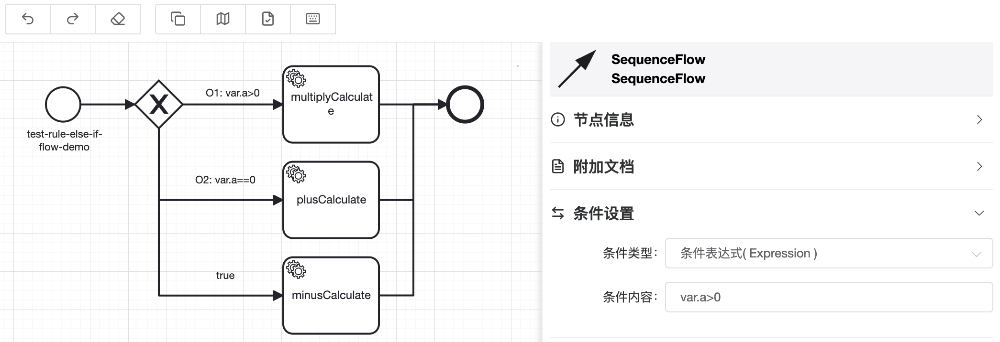
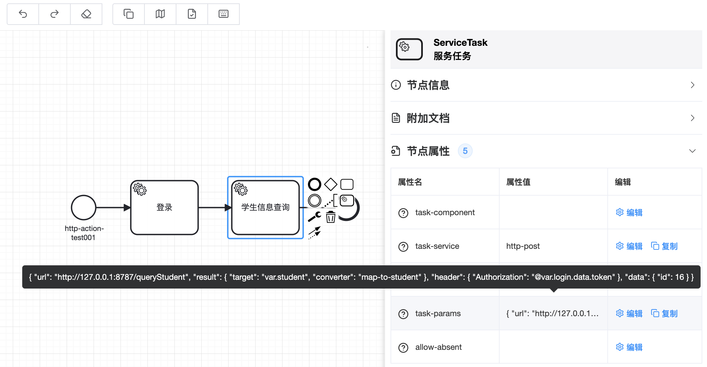
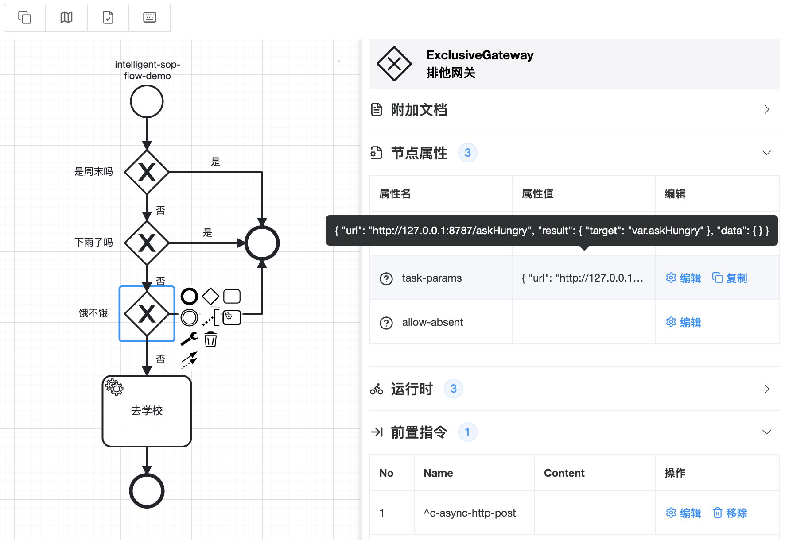
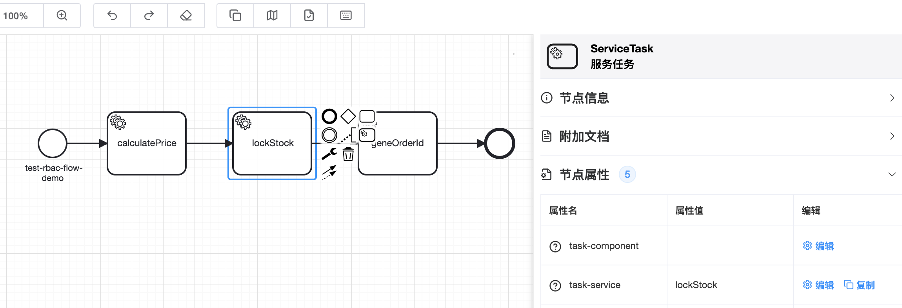

&nbsp;&nbsp;&nbsp;&nbsp;🟢 [项目主页](http://kstry.cn)

&nbsp;&nbsp;&nbsp;&nbsp;🟢 [Kstry 使用场景](http://kstry.cn/doc/understandkstry/use_case_demo.html)

&nbsp;&nbsp;&nbsp;&nbsp;🟢 [Kstry 概念介绍](http://kstry.cn/doc/understandkstry/understand-kstry.html)

&nbsp;&nbsp;&nbsp;&nbsp;🟢 [Kstry 使用文档](http://kstry.cn/doc/specification/quick_start.html)

&nbsp;&nbsp;&nbsp;&nbsp;🟢 [Kstry 流程配置台](http://kstry.cn/modeler)

&nbsp;&nbsp;&nbsp;&nbsp;🟢 [Kstry 使用demo](https://gitee.com/kstry/kstry-core/tree/master/kstry-flux-demo)

&nbsp;&nbsp;&nbsp;&nbsp;🟢 [功能测试](https://gitee.com/kstry/kstry-core/tree/master/kstry-core/src/test/java/cn/kstry/framework/test)

# 为什么说Kstry是业务架构首选框架？

**Kstry有如下使用场景：**

## 一、流程编排

::: tip
Kstry可以将原本存在于代码中错综复杂的方法调用关系以可视化流程图的形式更直观的展示出来。框架可以隔离各个业务模型的独自演进过程并屏蔽期间的相互影响，与此同时还提供了模型与模型间关系的动态化编排机制
:::

[流程编排演示](http://kstry.cn/doc/specification/quick_start.html)

[流程编排演示代码地址](https://gitee.com/kstry/kstry-core/tree/master/kstry-flux-demo/kstry-flux-demo-web/src/main/java/cn/kstry/flux/demo)

[支持动态化流程编排](http://kstry.cn/doc/specification/process_choreography.html#_2-12-%E5%8A%A8%E6%80%81%E6%B5%81%E7%A8%8B%E9%85%8D%E7%BD%AE)

## 二、并发框架

::: tip
框架中可以通过配置`open-async=true`属性使并行网关、包含网关后面的流程并发执行。可以仅仅将Kstry作为并发框架应用在项目中，其提供的灵活性高于CompletableFuture
:::

**需要实现的异步流程图：**


**代码方式定义上述流程：**

```java
@Bean
public ProcessLink testAsyncFlowProcess() {
    StartProcessLink processLink = StartProcessLink.build(ProcessConfig::testAsyncFlowProcess);
    InclusiveJoinPoint inclusive01 = processLink
            .nextService(CalculateService::atomicInc).name("Task01").build()
            .nextInclusive(processLink.inclusive().openAsync().build());
    InclusiveJoinPoint inclusive04 = processLink
            .nextService(CalculateService::atomicInc).name("Task04").build()
            .nextInclusive(processLink.inclusive().openAsync().build());

    processLink.inclusive().build().joinLinks(
                    inclusive01.nextService(CalculateService::atomicInc).name("Task02").build(),
                    processLink.inclusive().build().joinLinks(
                            inclusive01.nextService(CalculateService::atomicInc).name("Task03").build(),
                            inclusive04.nextService(CalculateService::atomicInc).name("Task05").build()
                    ).nextService(CalculateService::atomicInc).name("Task07").build(),
                    inclusive04.nextService(CalculateService::atomicInc).name("Task06").build()
            ).nextService(CalculateService::atomicInc).name("Task08").build()
            .end();
    return processLink;
}
```

**服务节点方法定义：**

```java
@TaskService
public void atomicInc(@ReqTaskParam(reqSelf = true) AtomicInteger atomicInteger) {
    int i = atomicInteger.incrementAndGet();
    System.out.println("atomicInc... " + i);
    try {
        TimeUnit.MILLISECONDS.sleep(200);
    } catch (InterruptedException e) {
        throw new RuntimeException(e);
    }
}
```

**流程执行：**

```java
@Test
public void testAsyncFlowDemo() {
    // 配置文件调用
    AtomicInteger atomicInteger = new AtomicInteger();
    StoryRequest<Void> fireRequest = ReqBuilder.returnType(Void.class)
            .trackingType(TrackingTypeEnum.SERVICE_DETAIL).request(atomicInteger).startId("async-flow-demo")
            .build();
    TaskResponse<Void> result = storyEngine.fire(fireRequest);
    Assert.assertTrue(result.isSuccess());
    Assert.assertEquals(8, atomicInteger.intValue());

    // 代码流程调用
    atomicInteger = new AtomicInteger();
    fireRequest = ReqBuilder.returnType(Void.class)
            .trackingType(TrackingTypeEnum.SERVICE_DETAIL).request(atomicInteger).startProcess(ProcessConfig::testAsyncFlowProcess)
            .build();
    result = storyEngine.fire(fireRequest);
    Assert.assertTrue(result.isSuccess());
    Assert.assertEquals(8, atomicInteger.intValue());
}
```


如上所示的流程执行顺序如下：

&nbsp;&nbsp;&nbsp;&nbsp;🟢 Task01执行完之后并发执行Task02、Task03

&nbsp;&nbsp;&nbsp;&nbsp;🟢 Task04执行完之后并发执行Task05、Task06

&nbsp;&nbsp;&nbsp;&nbsp;🟢 Task07将等待Task03和Task05都完成后执行

&nbsp;&nbsp;&nbsp;&nbsp;🟢 当Task02、Task06、Task07都执行完之后再执行Task08

&nbsp;&nbsp;&nbsp;&nbsp;🟢 最后结束流程

## 三、规则引擎

::: tip
可以使用框架提供的服务节点、网关、带判断条件的有向线段等组件配置规则流程图，再有动态流程能力的支持，完全可以实现一套动态化的规则引擎
:::

**AND逻辑：**


**节点方法定义及执行：**

```java
// 节点方法定义
@NoticeResult
@TaskService
public int plusCalculate(@VarTaskParam int a, @VarTaskParam int b) {
    return a + b;
}

// 执行
@Test
public void testRuleAndFlowDemo() {
    RuleJudgeRequest ruleJudgeRequest = new RuleJudgeRequest();
    ruleJudgeRequest.setA(10);
    ruleJudgeRequest.setB(5);
    ruleJudgeRequest.setC(15);
    StoryRequest<Integer> fireRequest = ReqBuilder.returnType(Integer.class)
            .trackingType(TrackingTypeEnum.SERVICE_DETAIL).varScopeData(ruleJudgeRequest).startId("test-rule-and-flow-demo")
            .build();
    TaskResponse<Integer> result = storyEngine.fire(fireRequest);
    Assert.assertTrue(result.isSuccess());
    Assert.assertEquals(15, (int) result.getResult());
}
```

&nbsp;&nbsp;&nbsp;&nbsp;🟢 判断多个条件都满足时候执行目标动作，否则结束流程

**OR逻辑：**



&nbsp;&nbsp;&nbsp;&nbsp;🟢 排他网关有多个出度表达式被解析成true时，会选择第一个为true的分支继续向下执行，其他的将会被忽略，所以后面出度只要加上判断表达式便可以实现OR的逻辑

&nbsp;&nbsp;&nbsp;&nbsp;🟢 可以结合`o{数字}: 表达式`格式定义表达式的同时指定后面出度的判断顺序，从而实现`if... else if... else if... else...`的逻辑

&nbsp;&nbsp;&nbsp;&nbsp;🟢 也可以实现多个前置条件均未满足时执行默认逻辑的流程，这个可以理解成是NONE的语法

**满足N个条件时继续：**


&nbsp;&nbsp;&nbsp;&nbsp;🟢 可以使用包含网关来配置当网关入度任务执行完成几个时流程便可以继续向下执行。指定的数量应该大于0且小于等于网关入度任务数

## 四、微服务整合

::: tip
利用框架本身的编排能力再结合RPC、HTTP等客户端可以实现对微服务能力的编排。结合StoryBus和其上的`task-params`属性、自定义指令、类型转换器等可以轻松实现服务间的参数传递与转换
:::

**以HTTP为例可以先实现一个服务节点方法：**

```java
@TaskService(name = "http-post")
public void httpPostAction(ScopeDataOperator dataOperator,
                           @TaskParam("url") String url,
                           @TaskParam("result") ResultProperty result,
                           @TaskParam("data") Map<String, Object> data,
                           @TaskParam("header") Map<String, String> header) {
    if (StringUtils.isBlank(url)) {
        return;
    }
    try {
        HttpPost httpPost = new HttpPost(url);
        if (data == null) {
            data = Maps.newHashMap();
        }
        httpPost.setEntity(new StringEntity(JSON.toJSONString(data), ContentType.APPLICATION_JSON));
        if (MapUtils.isNotEmpty(header)) {
            header.forEach((k, v) -> {
                if (StringUtils.isAnyBlank(k, v)) {
                    return;
                }
                httpPost.setHeader(k, v);
            });
        }
        CloseableHttpResponse response = httpClient.execute(httpPost);
        String r = EntityUtils.toString(response.getEntity());
        log.info("HttpActionService httpPostAction success. url: {}, header: {}, data: {}, response: {}, result: {}", url, header, data, response, r);
        if (StringUtils.isBlank(r)) {
            return;
        }
        if (result == null) {
            return;
        }
        noticeResult(dataOperator, result, r);
    } catch (Exception e) {
        log.error("HttpActionService httpPostAction error. url: {}, header: {}, data: {}", url, header, data, e);
        throw new BusinessException("-100", e.getMessage(), e);
    }
}

private void noticeResult(ScopeDataOperator dataOperator, ResultProperty resultProperty, String result) {
    if (StringUtils.isBlank(resultProperty.getTarget()) || !ElementParserUtil.isValidDataExpression(resultProperty.getTarget())) {
        return;
    }
    JSONObject jsonObject = JSON.parseObject(result);
    Object resData = jsonObject.get("data");
    if (resData != null) {
        jsonObject.put("data", typeConverterProcessor.convert(resultProperty.getConverter(), resData, Optional.ofNullable(resultProperty.getType())
                        .filter(StringUtils::isNotBlank).map(className -> {
                            try {
                                return Class.forName(className);
                            } catch (Exception e) {
                                log.error("HttpActionService convert. type invalid. type: {}", className, e);
                            }
                            return null;
                        }).orElse(null)
                ).getValue()
        );
    }
    dataOperator.setData(resultProperty.getTarget(), jsonObject);
}

@Data
public class ResultProperty {

    private String target; // 指定返回结果通知到StoryBus中的什么位置

    private String converter; // 指定类型转换器

    private String type; // 指定结果类型
}
```

**编排微服务流程：**



&nbsp;&nbsp;&nbsp;&nbsp;🟢 流程中首先会执行登录操作

```json
{
    "url": "http://127.0.0.1:8787/login", // 访问的URL
    "result": {
        "target": "var.login", // 结果通知位置
        "type": "java.util.HashMap" // 返回结果类型
    },
    "data": {
        "username": "admin", // POST请求体数据，可以常量也可以变量
        "password": "admin"
    }
}
```

&nbsp;&nbsp;&nbsp;&nbsp;🟢 第二步做资源查询

```json
{
    "url": "http://127.0.0.1:8787/queryStudent",
    "result": {
        "target": "var.student",
        "converter": "map-to-student" // 查询到的结果使用类型转换器转换成Student对象
    },
    "header": {
        "Authorization": "@var.login.data.token" // 从登录结果中拿到token放到header中用来鉴权
    },
    "data": {
        "id": "@req.id"
    }
}
```

**将上面流程编排中查询学生分数信息的流程用微服务编排来实现：**


&nbsp;&nbsp;&nbsp;&nbsp;🟢 如果有需要可以结合子流程拦截器实现自定义的分布式事务

&nbsp;&nbsp;&nbsp;&nbsp;🟢 框架还支持Reactor方式的服务节点方法定义，结合asyncHttpClient可以做到发送请求后立即释放工作线程，等请求收到响应触发回调任务后再驱动流程继续向后执行

```java
@TaskService(name = "async-http-post")
public Mono<Void> asyncHttpPostAction(ScopeDataOperator dataOperator,
                                      @TaskParam("url") String url,
                                      @TaskParam("result") ResultProperty result,
                                      @TaskParam("data") Map<String, Object> data,
                                      @TaskParam("header") Map<String, String> header) {
    if (StringUtils.isBlank(url)) {
        return Mono.empty();
    }
    try {
        SimpleRequestBuilder requestBuilder = SimpleRequestBuilder.post(url);
        if (MapUtils.isNotEmpty(header)) {
            header.forEach((k, v) -> {
                if (StringUtils.isAnyBlank(k, v)) {
                    return;
                }
                requestBuilder.setHeader(k, v);
            });
        }
        if (data == null) {
            data = Maps.newHashMap();
        }
        requestBuilder.setBody(JSON.toJSONString(data), ContentType.APPLICATION_JSON);
        SimpleHttpRequest request = requestBuilder.build();

        Pair<CompletableFuture<SimpleHttpResponse>, FutureCallback<SimpleHttpResponse>> futureCallbackPair = getFutureCallbackPair();
        asyncHttpClient.execute(request, futureCallbackPair.getValue());
        return Mono.fromFuture(futureCallbackPair.getKey()).mapNotNull(response -> {
            String r = null;
            try {
                r = response.getBodyText();
                log.info("HttpActionService async httpPostAction success. url: {}, header: {}, data: {}, response: {}, result: {}", url, header, request.getBody().getBodyText(), response, r);
                if (StringUtils.isBlank(r)) {
                    return null;
                }
                noticeResult(dataOperator, result, r);
                return null;
            } catch (Exception e) {
                log.error("HttpActionService async httpPostAction error. url: {}, header: {}, data: {}, response: {}, result: {}", url, header, request.getBody().getBodyText(), response, r);
                throw new RuntimeException(e);
            }
        });
    } catch (Exception e) {
        log.error("HttpActionService async httpPostAction error. url: {}, header: {}, data: {}", url, header, data, e);
        throw new BusinessException("-100", e.getMessage(), e);
    }
}
```

## 五、智能SOP

::: tip
规则引擎加微服务调用可以作为智能SOP使用
:::

**一个决策是否要去上学的例子：**



&nbsp;&nbsp;&nbsp;&nbsp; 无需定义服务节点，在排他网关上配置前置指令`^c-async-http-post`，就会在网关执行前进行HTTP接口调用，示例中一共发送了三次请求，`task-params`依次配置和请求日志如下：

```json
{
    "url": "http://127.0.0.1:8787/askWeek",
    "result": {
        "target": "var.askWeek"
    },
    "data": {
        
    }
}
// HttpActionService async httpPostAction success. url: http://127.0.0.1:8787/askWeek, header: null, data: {}, response: 200 null HTTP/1.1, result: {"success":true,"code":0,"msg":"success","data":5}

{
    "url": "http://127.0.0.1:8787/askRain",
    "result": {
        "target": "var.askRain"
    },
    "data": {
        
    }
}
// HttpActionService async httpPostAction success. url: http://127.0.0.1:8787/askRain, header: null, data: {}, response: 200 null HTTP/1.1, result: {"success":true,"code":0,"msg":"success","data":false}

{
    "url": "http://127.0.0.1:8787/askHungry",
    "result": {
        "target": "var.askHungry"
    },
    "data": {
        
    }
}
// HttpActionService async httpPostAction success. url: http://127.0.0.1:8787/askHungry, header: null, data: {}, response: 200 null HTTP/1.1, result: {"success":true,"code":0,"msg":"success","data":false}
```

&nbsp;&nbsp;&nbsp;&nbsp; 比如在判断“饿不饿”时，就可以使用条件表达式，`var.askHungry.data`（是）、`!var.askHungry.data`（否）来判断和决策

&nbsp;&nbsp;&nbsp;&nbsp; “去上学”服务节点的`task-params`属性配置：

```json
{
    "askWeek":"@var.askWeek.data",
    "askRain":"@var.askRain.data",
    "askHungry":"@var.askHungry.data"
}
```

&nbsp;&nbsp;&nbsp;&nbsp; “去上学”服务节点方法定义及日志

```java
@NoticeResult
@TaskService
public boolean gotoSchool(int askWeek, boolean askRain, boolean askHungry) {
    log.info("gotoSchool. askWeek: {}, askRain: {}, askHungry: {}", askWeek, askRain, askHungry);
    return true;
}
// gotoSchool. askWeek: 5, askRain: false, askHungry: false
```

## 六、数据字典

::: tip
任何系统中，前端界面无可避免都有展示数据的诉求，在权限允许的情况下，Kstry可以做到通过零编码纯配置的方式查询并返回给前端整个微服务架构中任意服务的指定结果字段
:::

**沿用上面微服务整合中查询学生分数的例子**


&nbsp;&nbsp;&nbsp;&nbsp; 接口实际返回的结果如下：

```json
{
    "success": true,
    "code": 0,
    "msg": "success",
    "data": {
        "student": {
            "id": 66,
            "name": "张一",
            "address": "XX省XX市XX区",
            "idCard": "133133199401012345",
            "birthday": "1994-01-01"
        },
        "scoreInfos": [
            {
                "score": 99,
                "studentId": 66,
                "studyYear": "2013-1-2",
                "course": "语文",
                "classId": 1,
                "classInfo": {
                    "id": 1,
                    "name": "班级1"
                }
            },
            {
                "score": 88,
                "studentId": 66,
                "studyYear": "2013-1-2",
                "course": "数学",
                "classId": 1,
                "classInfo": {
                    "id": 1,
                    "name": "班级1"
                }
            },
            // 此处省略...
        ]
    }
}
```

&nbsp;&nbsp;&nbsp;&nbsp; 流程配置无需改动，只变更调用方式：

```java
@PostMapping("/scoreQuery5")
public Mono<R<Map<String, Object>>> scoreQuery5(@RequestBody List<String> keys) {
    QueryScoreRequest request = new QueryScoreRequest();
    request.setStudentId(77L);
    request.setNeedScore(true);
    StoryRequest<Map<String, Object>> fireRequest = ReqBuilder.<Map<String, Object>>resultType(Map.class)
            .recallStoryHook(WebUtil::recallStoryHook).trackingType(TrackingTypeEnum.SERVICE_DETAIL).request(request).startId("http-student-score-query-process")
            .resultBuilder((res, query) -> {
                Map<String, Object> map = Maps.newHashMap();
                keys.forEach(key -> map.put(key, query.getData(key)));
                return map;
            }).build();
    Mono<Map<String, Object>> fireAsync = storyEngine.fireAsync(fireRequest);
    return WebUtil.dataDecorate(request, fireAsync);
}
```

&nbsp;&nbsp;&nbsp;&nbsp;🟢 `resultBuilder`是流程执行完成之后，允许对结果进行加工处理的回调函数。其中有两个参数：

&nbsp;&nbsp;&nbsp;&nbsp;&nbsp;&nbsp;&nbsp;&nbsp;🔷 `res：` 流程中实际返回的结果

&nbsp;&nbsp;&nbsp;&nbsp;&nbsp;&nbsp;&nbsp;&nbsp;🔷 `query：` ScopeDataOperator对象

&nbsp;&nbsp;&nbsp;&nbsp; 如上的改造后，客户端就可以获取指定的数据结果了：


## 七、平台能力

::: tip
框架提供的平台型能力可以根据请求信息或其他定义装载有不同权限的角色，使用不同角色请求同一流程时，提供的实际服务可以做到千人千面
:::

**定义通用流程**



**定义服务节点方法**

```java
@TaskComponent(name = "orderService")
public class InnerOrderService implements OrderService {

    @Override
    @TaskService
    @NoticeVar(target = CommonFields.F.price)
    public long calculatePrice(long goodsId) {
        System.out.println("InnerOrderService calculatePrice...");
        return 100L;
    }

    @Override
    @TaskService
    @NoticeVar(target = CommonFields.F.lockStockResult)
    public boolean lockStock(long goodsId) {
        System.out.println("InnerOrderService lockStock...");
        return true;
    }

    @Override
    @NoticeResult
    @TaskService
    public long geneOrderId(long price, long goodsId) {
        System.out.println("InnerOrderService geneOrderId...");
        return 2987;
    }
}
```

**普通执行方式**

```java
@Test
public void testRbacFlowDemo() {
    InScopeData varScopeData = new InScopeData(ScopeTypeEnum.VARIABLE);
    varScopeData.put(CommonFields.F.goodsId, 10);

    StoryRequest<Long> fireRequest = ReqBuilder.returnType(Long.class)
            .trackingType(TrackingTypeEnum.SERVICE_DETAIL).varScopeData(varScopeData).startId("test-rbac-flow-demo")
            .build();
    TaskResponse<Long> result = storyEngine.fire(fireRequest);
    Assert.assertTrue(result.isSuccess());
    Assert.assertEquals(100L, varScopeData.get(CommonFields.F.price));
    Assert.assertEquals(2987L, (long) result.getResult());
}

// 日志打印
// InnerOrderService calculatePrice...
// InnerOrderService lockStock...
// InnerOrderService geneOrderId...
```

**定义扩展能力点**

```java
@TaskComponent(name = "orderService", scanSuper = false)
public class ExternalOrderService extends InnerOrderService {

    @Override
    @NoticeVar(target = CommonFields.F.price)
    @TaskService(ability = "external")
    public long calculatePrice(long goodsId) {
        System.out.println("ExternalOrderService calculatePrice...");
        return 200L;
    }

    @Override
    @NoticeVar(target = CommonFields.F.lockStockResult)
    @TaskService(ability = "external")
    public boolean lockStock(long goodsId) {
        System.out.println("ExternalOrderService lockStock...");
        return false;
    }
}
```

&nbsp;&nbsp;&nbsp;&nbsp;🟢 `@TaskService`中的`ability = "external"`代表为`calculatePrice`服务节点新增`external`的扩展点

**定义角色并分配权限**

```java
@Component
public class AllocateRoleConfig implements DynamicRole {

    @Override
    public Optional<Role> getRole(String key) {
        if (Objects.equals("test-rbac-flow-demo@external-business-id", key)) {
            ServiceTaskRole serviceTaskRole = new ServiceTaskRole();
            serviceTaskRole.addPermission(PermissionUtil.permissionList("r:calculatePrice@external, r:lockStock@external"));
            return Optional.of(serviceTaskRole);
        }
        return Optional.empty();
    }
}
```

&nbsp;&nbsp;&nbsp;&nbsp;🟢 创建实例实现`DynamicRole`接口并交给Spring容器管理，便可以实现角色动态分配器


&nbsp;&nbsp;&nbsp;&nbsp;🟢 请求处理时如果startId和businessId都能匹配上，之后会创建带有自定义权限的角色


**匹配角色执行扩展业务**

```java
@Test
public void testRbacFlowDemo() {
    InScopeData varScopeData = new InScopeData(ScopeTypeEnum.VARIABLE);
    varScopeData.put(CommonFields.F.goodsId, 10);

    StoryRequest<Long> fireRequest = ReqBuilder.returnType(Long.class)
            .businessId("external-business-id")
            .trackingType(TrackingTypeEnum.SERVICE_DETAIL).varScopeData(varScopeData).startId("test-rbac-flow-demo")
            .build();
    TaskResponse<Long> result = storyEngine.fire(fireRequest);
    Assert.assertTrue(result.isSuccess());
    Assert.assertEquals(200L, varScopeData.get(CommonFields.F.price));
    Assert.assertEquals(2987L, (long) result.getResult());
}
// 日志打印
// ExternalOrderService calculatePrice...
// ExternalOrderService lockStock...
// InnerOrderService geneOrderId...
```

执行服务节点时，如果根据角色匹配到了扩展业务会跳过默认业务点直接执行扩展业务，如果未匹配到时可以默认节点兜底

## 我想为Kstry提交代码
[代码提交步骤](https://gitee.com/kstry/kstry-core/blob/master/doc/join-and-coding.md)

